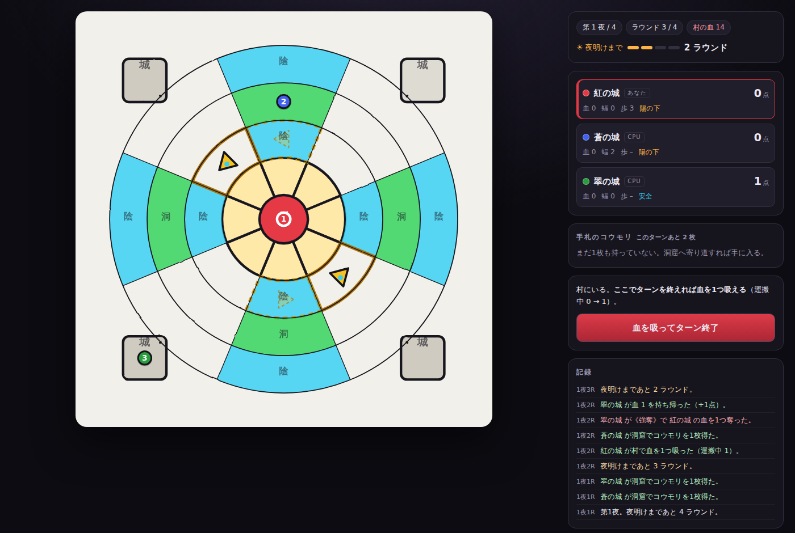

# ヴァンパイア・ハウス

中心の村で血を吸い、四隅の城へ持ち帰る。朝までに帰れなければ、すべて失う。

同心円の盤面を舞台にした2〜4人用ボードゲームのデジタル版。
インカの宝石（引き際の判断）とカタン（リソース管理と発展カード）を下敷きにしている。



盤面はルール（同心円4リング＋放射線8本）をそのまま描いた図形で、
座標は写真合わせではなくルールから機械的に決まる（詳細は [`docs/design.md`](docs/design.md) 冒頭）。

## 動かす

```sh
npm install
npm run dev      # http://localhost:5173
```

| コマンド | 内容 |
| --- | --- |
| `npm run dev` | 開発サーバー |
| `npm run build` | 型チェック＋本番ビルド（`dist/`） |
| `npm test` | ルールとボットのテスト（95件） |
| `npm run balance` | ボット自動対戦によるバランス計測 |

依存はビルドツールのみ。実行時のライブラリは使っていない。

## 遊びかた

- **移動** 毎ターン3歩。同心円に沿って横へ、放射線に沿って内外へ動く
- **血** 中心の村でターンを終えるたびに **10 / 30 / 50 / 100** のどれかを吸える。
  いくつ出るかは振ってみるまで分からない。自分の城に入れば得点。**持ち帰るまでは0点**
- **血＝点** 抱えている血の数字が、そのまま得点。換算式は無い。
  100を引いた夜はその場で帰りたくなり、10しか出なければもう1ターン粘りたくなる
- **太陽** 夜は**3ラウンドは必ず続く**。そのあとは毎ラウンド 1/3 で**空が白む**。
  白んだら、**そのラウンドの終わりに必ず朝**が来る ―― 逃げる猶予はきっかり1ラウンド。
  避難所か城にいない者は焼かれ、抱えた血をすべて失う。**肩代わりできるのは蝙蝠傘だけ**
- **予告ラウンド** 賭けの中身は「朝が来るか」ではなく
  **「来たとして、そこから1ラウンドで椅子へ届くか」**。全員が同時に椅子へ走る、
  この盤面で唯一の場面で、コウモリはすべてここで撃つためにある
- **避難所** テント2つ＋洞窟2つの計4マスだけ。**すべて定員1人**。
  移動力3で**村から間に合うのはテント2マスだけ**（洞窟は4歩、城は5歩で届かない）――
  つまり椅子を奪い合うのは「村で粘った者」だけになる
- **ハンター** 黄色い三角。リング2を1ラウンドに1マスずつ周回する。触れれば即死。
  完全に決定論で、次の一歩が盤面に予告される。2体は常に4セクター離れて回り、
  テントの間隔もちょうど4なので、**8ラウンドに2回、テントが両方同時に塞がる**
- **洞窟** 最外リングの左右2つだけ。通るとコウモリ（発展カード）を1枚引ける（手札は3枚まで）。
  岩陰が陽を遮るので日陰も兼ねるが、城まで2歩なので椅子としては城の劣化版
- **仕留め** 影渡りで相手をハンターに触れさせると、相手が抱えていた血はすべて自分のものになる
- **先手** 夜ごとに1つずつ回る
- **決着** 4夜が明けたら終わり。**最終夜は村が3倍濃い**（持ち帰りの倍率ではなく、湧く血そのものが増える）

### コウモリ（4種18枚）

自己強化の札は1枚も無い。すべて**締め出し**か、締め出されないための札。

| カード | 枚数 | 効果 |
| --- | --- | --- |
| スタン罠 | 3 | 今いるマスに罠を仕掛ける。**全員に見える**。踏んだ相手は**そのマスに捕まり**、その手番の足が止まる |
| 強襲 | 3 | このターン、通り抜けたマスにいる相手を**組み伏せる**。抱えていた血をすべて奪い、その手番の足を止める |
| 影渡り | 6 | 城の外の相手1人と位置を入れ替える。避難所を横取りできる |
| 蝙蝠傘 | 6 | 宣言して差す。次の即死（陽光・ハンター）を1回だけ肩代わりして消える |

**罠が効く場所は盤面に1つしかない ―― 城の門。** 城は最外リングの1マスにしか
繋がっていないので、門を塞がれた者は罠を踏んで弾き返されるしかない
（他のどのマスを塞いでも1歩の迂回で済む）。しかも洞窟は門の隣にあるので、
**引いた足で隣の城の門へ張り、洞窟へ戻って朝を待つ**が2歩で回る。

罠は**移動の途中でも、入った瞬間に**発動する（終点である必要はない）。
塞がれた側にも手はある ―― 1手番を捨てて踏み抜いて帰るか、今夜は避難所で
やり過ごして翌夜に持ち越すか。ただし**予告ラウンドに踏まされればそのまま焼死**、
最終夜は持ったままでは0点なので踏み抜くしかない。

避難所に張った罠は相手を椅子に座らせてしまうが、**最終夜の避難所は1点にもならない**
―― 血を抱えたまま椅子に貼り付けられるのは、そのまま0点で終わることを意味する。

強襲は当たり判定を広げず、**一撃を重く**してある。相手のマスへちょうど乗る精度が要る
代わりに、決まれば相手が抱えていた血をすべて奪い、その場に押さえて足を止められる。
**仕留めはしない** ―― 奪うのは積荷と一手番ぶんの足だけで、盤上の位置は相手に残る。
即死ではないので蝙蝠傘（陽光とハンターの肩代わり）では防げない。

ダイスは2つだけで、どちらも**プレイヤーが決めたあとに振られる**。
「村にもう1ターン残る」と決めた者にだけ吸血の目が回り、
「まだ帰らない」と決めた盤面に対して夜明けの目が振られる。
決定の前に降ってくる乱数は置いていない（設計の経緯は
[`docs/balance.md`](docs/balance.md) §1）。

2〜4人のホットシート対戦に対応。空いた席はボットが埋める（全席ボットの観戦も可能）。

PWA対応。スマホのブラウザで開いて「ホーム画面に追加」すればアプリのように起動でき、
一度開いたページはオフラインでも遊べる（`public/manifest.webmanifest` と `public/sw.js`）。

ルールの詳細と、企画段階で未決定だった項目をどう確定させたかは
[`docs/design.md`](docs/design.md) に、数値の根拠と実測データは
[`docs/balance.md`](docs/balance.md) に、実装の構成は
[`docs/architecture.md`](docs/architecture.md) にまとめてある。

## 構成

```
src/game/    ルール本体。DOM に依存しない純粋なロジック
src/assets/  提供された盤面写真（board.png。現状どこからも参照していない）
src/ui/      ルールから決まる座標で同心円と扇形を描き、当たり判定を重ねる SVG 層
docs/        企画書と確定版ルール
scripts/     バランス検証用シミュレーション
```

ゲームロジックと描画が分離してあるので、ルールを変えるときは
`src/game/` のテストだけで挙動を確認できる。
